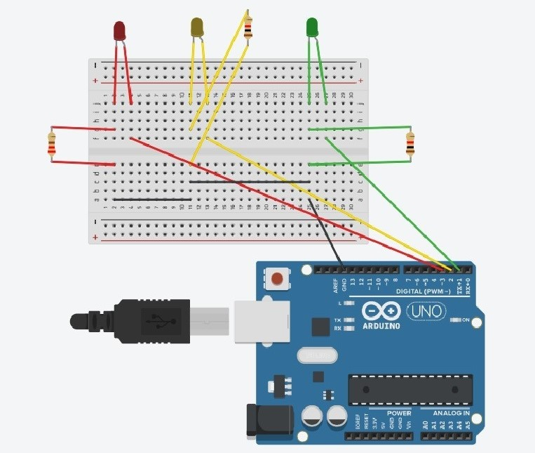
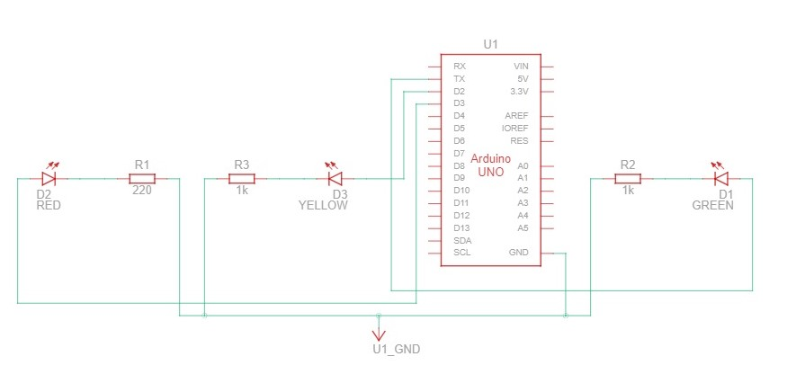

<!--

author:   Sebastian Zug
email:    sebastian.zug@informatik.tu-freiberg.de
version:  0.0.1
language: de
narrator: Deutsch Female

import: https://raw.githubusercontent.com/liaTemplates/AVR8js/main/README.md


import: https://fjangfaragesh.github.io/AVR8js-mem/INCLUDE.md


-->


[](https://liascript.github.io/course/?https://raw.githubusercontent.com/Mr-Nair/Hiwi-Arduino/main/README.md)


# Arduino Programming Tutorial

## Description
<br>
<br>
> This project will aid students in their seminars. Each student will have 12 mins for their presentation. The Start of the seminar will be marked by a **Green**<!-- class = "animated infinite bounce" style = "color: green;" --> LED light which will glow for 10 mins. Following that, a **Yellow**<!-- class = "animated infinite bounce" style = "color: yellow;" --> LED light will glow for 100 secs which alerts the student and for the last 20 seconds, the **Yellow**<!-- class = "animated infinite bounce" style = "color: yellow;" --> LED light will blink. Finally, at the end of 12 mins, a  **Red**<!-- class = "animated infinite bounce" style = "color: red;" --> LED light will glow.


## Circuit Diagram
<br>




## Schematic Circuit Diagram
<br>




## Question Time!!

> Which leg of this LED is Anode?

[(X)] Left
[( )] Right


> Which are the commonly Arduino board(s)?
[[X]] Arduino UNO
[[X]] Arduino Nano
[[X]] Arduino Mega
[[X]] Arduino Zero


> Which language(s) is supported by Arduino IDE?
- [[ ]] Python
- [[X]] C++
- [[X]] C
- [[X]] Java

> what is the unit of time used in Delay function in the language C.
- [( )] Seconds
- [(x)] milliseconds
- [( )] Microseconds
- [( )] Nanoseconds


## Code

```cpp   LED Light
#define ledG 1
#define ledY 2
#define ledR 3

void setup() {

pinMode(ledG, OUTPUT);
pinMode(ledY, OUTPUT);
pinMode(ledR, OUTPUT);
}

void loop() {

 digitalWrite (ledG,1);
 delay(600000);   //activates green light for 10min ie. 10x60x1000 millisec
 digitalWrite (ledG,0);
 digitalWrite (ledY,1);
 delay(100000); //activates yellow light for 100 seconds
 int i=0;
    while( i<21) //20 sec  blinking of yellow light
    {  
       delay(500);
       digitalWrite (ledY,0);
       delay(500);
       digitalWrite (ledY,1);
        i++;
 }
  digitalWrite (ledY,0);

 digitalWrite (ledR,1);
 delay(1000);
  digitalWrite (ledR,0);
}
```

## Working in simulation

<div id="example1">
<wokwi-led color="green" pin="1" label="1"></wokwi-led>
<wokwi-led color="yellow" pin="2" label="2"></wokwi-led>
<wokwi-led color="red" pin="3" label="3"></wokwi-led>
<span id="simulation-time"></span></div>

```cpp
#define ledG 1
#define ledY 2
#define ledR 3


void setup() {
pinMode(ledG, OUTPUT);
pinMode(ledY, OUTPUT);
pinMode(ledR, OUTPUT);
}

void loop() {

 digitalWrite(ledG, HIGH);
 delay(10000);   //activates green light for 10 sec
  digitalWrite(ledG, LOW); 
  digitalWrite(ledY, HIGH);
 delay(5000); //activates yellow light for 5 seconds 
 int i=0;
    while( i<5) //5 sec  blinking of yellow light
    {  
       delay(500); 
       digitalWrite(ledY, LOW);
       delay(500);
       digitalWrite(ledY, HIGH);
        i++;
 }
  digitalWrite(ledY, LOW);
 digitalWrite(ledR, HIGH);
 delay(5000);
  digitalWrite(ledR, LOW);
}

```
@AVR8js.sketch

## Working in real world

<figure class="video_container">
  <video controls="true" width=700
   poster="Images/Preview.jpg">
    <source src="Images/VID_20220612172500.mp4" type="video/mp4">
  </video>
</figure>


 
