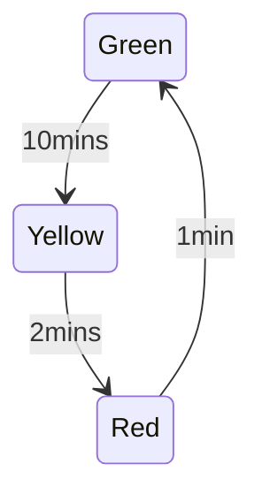

<!--

author:   Sebastian Zug & André Dietrich
email:    zug@ovgu.de   & andre.dietrich@ovgu.de
version:  0.1.7
language: de
narrator: Deutsch Female

import: https://github.com/LiaTemplates/AVR8js/main/README.md#10
        

-->


[](https://liascript.github.io/course/?https://raw.githubusercontent.com/Mr-Nair/Hiwi-Arduino/main/Statemachinemodel.md)

# Representing Time Keeper in a finite state machine model
## What is a finite state machine model??

> A finite-state machine (FSM) or finite-state automaton (automata), is a mathematical model of computation. It is an abstract machine that can be in exactly one of a finite number of states at any given time.

## Representation



   
## Code             

```cpp        Automata
struct def{

    int state;
    int next;
    int red;
    int yellow;
    int green;
    int timer;
};    // defined a data type

struct def fsm[5] = {

// state     Red             timer
//  |   next  |  Yellow       |
//  |    |    |   |    Green  |
//----------------------------------------------
{   0,   1,   0,  0,    1,      600},
{   1,   2,   0,  1,    0,      120},
{   2,   3,   1,  0,    0,      1},
{   3,   0,   0,  0,    0,      1},
};                                        // variable for finite state machine

const int ledG = 9;
const int ledY = 10;
const int ledR = 11;
int state = 0;
int i;

void setup() {
  pinMode(ledG, OUTPUT);
  pinMode(ledY, OUTPUT);
  pinMode(ledR, OUTPUT);
}

void loop() {
  if (fsm[state].red == 1) digitalWrite(ledR, HIGH);
  else digitalWrite(ledR, LOW);
  if (fsm[state].yellow == 1) digitalWrite(ledY, HIGH);
  else digitalWrite(ledY, LOW);
  if (fsm[state].green == 1) digitalWrite(ledG, HIGH);
  else digitalWrite(ledG, LOW);
  delay(fsm[state].timer*1000);
  state = fsm[state].next;

  if (state == 2)            // Blinking of red
  {
    for(i=0;i<300;i++)
    {
        
           if (fsm[state].red == 1) digitalWrite(ledR, HIGH);
           else digitalWrite(ledR, LOW);
           if (fsm[state].yellow == 1) digitalWrite(ledY, HIGH);
           else digitalWrite(ledY, LOW);
           delay(fsm[state].timer*1000);
           state = 2;
           if (fsm[state].red == 1) digitalWrite(ledR, HIGH);
           else digitalWrite(ledR, LOW);
           delay(fsm[state].timer*1000);
           state = 3;                  
    }
  state = fsm[state].next; 
  }
}

```


## Working in simulation

<div>
  <wokwi-led color="red" pin="13" port="B" label="13"></wokwi-led>
  <wokwi-led color="yellow" pin="12" port="B" label="12"></wokwi-led>
  <wokwi-led color="green" pin="11" port="B" label="11"></wokwi-led>
  <span id="simulation-time"></span>
</div>

```cpp             Automata
struct def{

    int state;
    int next;
    int red;
    int yellow;
    int green;
    int timer;
};    // defined a data type 

struct def fsm[5] = {

// state     Red             timer
//  |   next  |  Yellow       |
//  |    |    |   |    Green  |
//----------------------------------------------
{   0,   1,   0,  0,    1,      6},
{   1,   2,   0,  1,    0,      5},
{   2,   3,   1,  0,    0,      1},
{   3,   0,   0,  0,    0,      1}
};                                        // variable for finite state machine


const int ledG = 11;
const int ledY = 12;  
const int ledR = 13;
int state = 0;
int i;

void setup() {
  pinMode(ledG, OUTPUT);
  pinMode(ledY, OUTPUT);
  pinMode(ledR, OUTPUT);
}

void loop() {
  if (fsm[state].red == 1) digitalWrite(ledR, HIGH);
  else digitalWrite(ledR, LOW);
  if (fsm[state].yellow == 1) digitalWrite(ledY, HIGH);
  else digitalWrite(ledY, LOW);
  if (fsm[state].green == 1) digitalWrite(ledG, HIGH);
  else digitalWrite(ledG, LOW);
  delay(fsm[state].timer*1000);
  state = fsm[state].next;

  if (state == 2)            // Blinking of red
  {
    for(i=0;i<10;i++)
    {
        
           if (fsm[state].red == 1) digitalWrite(ledR, HIGH);
           else digitalWrite(ledR, LOW);
           if (fsm[state].yellow == 1) digitalWrite(ledY, HIGH);
           else digitalWrite(ledY, LOW);
           delay(fsm[state].timer*1000);
           state = 2;
           if (fsm[state].red == 1) digitalWrite(ledR, HIGH);
           else digitalWrite(ledR, LOW);
           delay(fsm[state].timer*1000);
           state = 3;                  
    }
  state = fsm[state].next; 
  }
}

```
@AVR8js.sketch

> Try changing the values of timer 


